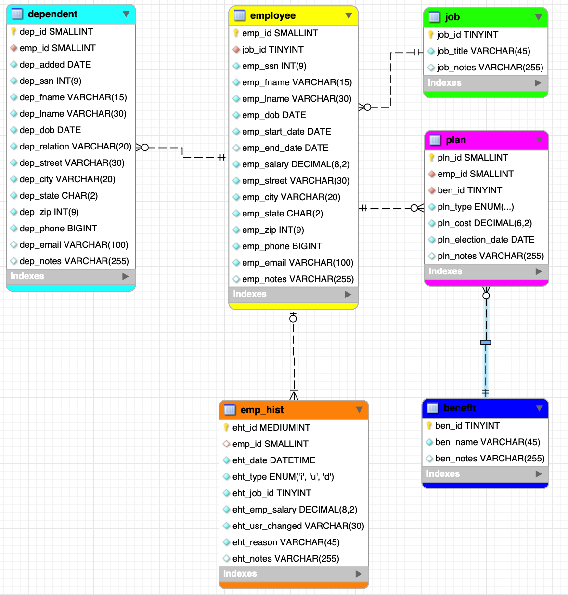

# LIS4930 A.I Applications

## Cole Plympton

### Assignment 1 Requirements:

*Five Parts:*

1. Distributed Version Control with Git and Bitbucket
2. AMPPS Installation
3. Questions 
4. Entity Relationship Diagram, and SQL Code 

#### README.md file should include the following items:

* Screenshot of A1 ERD
* At least one SQL Solution 
* Forward-engineered .sql file [lis3781_a1_solutions.sql](lis3781_a1_solutions.sql "lis3781_a1_solutions.sql")
* git commands with short descriptions

#### Git commands w/short descriptions:

- `git init` - Creates a new Git repository
- `git status` - Displays the state of the working directory and the staging area
- `git add` - Adds a change in the working directory to the staging area
- `git commit` - Captures a snapshot of the project's currently staged changes
- `git push` - Uploads local repository content to a remote repository
- `git pull` - Fetches and downloads content from a remote repository and immediately updates the local repository to match that content

#### Assignment Screenshots:

#### Screenshot of A1 ERD:

#### Screenshot of AMPPS Install:

