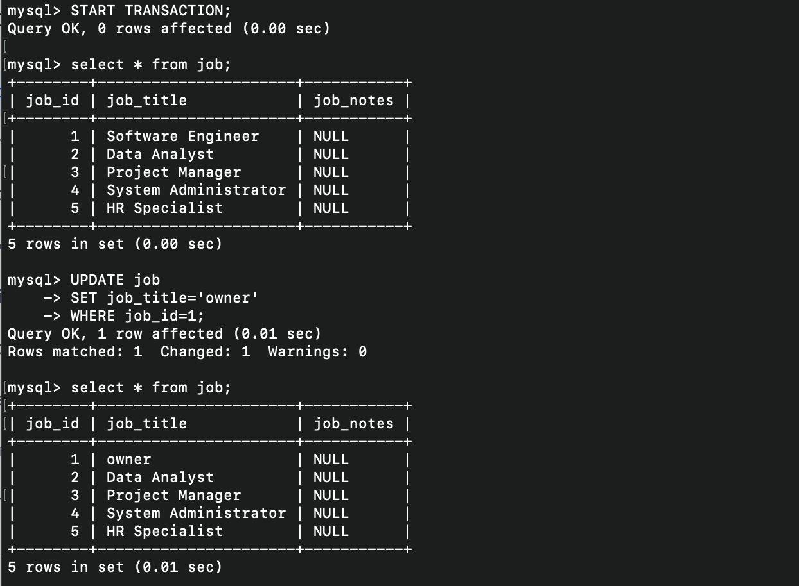
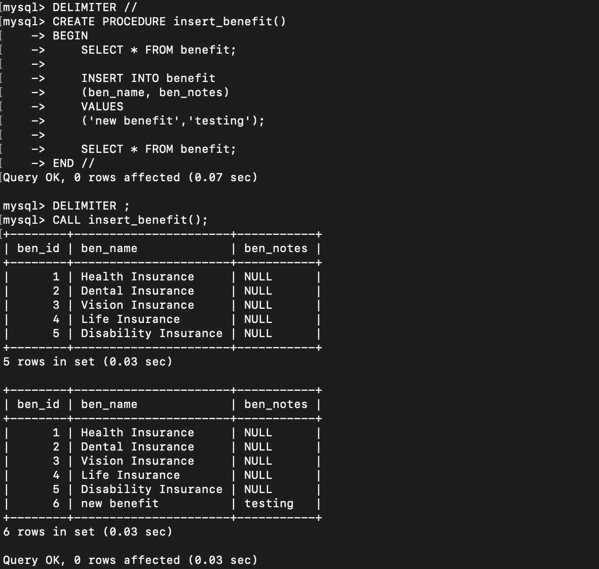

# LIS4930 A.I Applications

## Cole Plympton

### Assignment 1 Requirements:

*Five Parts:*

1. Distributed Version Control with Git and Bitbucket
2. AMPPS Installation
3. Questions 
4. Entity Relationship Diagram, and SQL Code [lis3781_a1_solutions.sql](lis3781_a1_solutions.sql "lis3781_a1_solutions.sql")

# A1 Database Business Rules:

The human resource (HR) department of the ACME company wants to contract a database modeler/designer to collect the following employee data for tax purposes: job description, length of employment, benefits, number of dependents and their relationships, DOB of both the employee and any respective dependents. In addition, employees’ histories must be tracked. Also, include the following business rules:

- Each employee may have one or more dependents.
- Each employee has only one job.
- Each job can be held by many employees.
- Many employees may receive many benefits.
- Many benefits may be selected by many employees (though, while they may not select any benefits—any dependents of employees may be on an employee’s plan).
- Employee/Dependent tables must use suitable attributes (See Assignment Guidelines).

## In Addition:
- **Employee**: SSN, DOB, start/end dates, salary.
- **Dependent**: Same information as their associated employee (though, not start/end dates), date added (as dependent), type of relationship (e.g., father, mother, etc.).
- **Job**: Title (e.g., secretary, service tech., manager, cashier, janitor, IT, etc.).
- **Benefit**: Name (e.g., medical, dental, long-term disability, 401k, term life insurance, etc.).
- **Plan**: Type (single, spouse, family), cost, election date (plans must be unique).
- **Employee history**: Jobs, salaries, and benefit changes, as well as who made the change and why.
- **Zero-filled data**: SSN, zip codes (not phone numbers; US area codes not below 201, NJ).
- **All tables must include a `notes` attribute.**

#### README.md file should include the following items:

* Screenshot of A1 ERD
* At least one SQL Solution 
* Forward-engineered .sql file [lis3781_a1_solutions.sql](lis3781_a1_solutions.sql "lis3781_a1_solutions.sql")
* git commands with short descriptions

#### Git commands w/short descriptions:

- `git init` - Creates a new Git repository
- `git status` - Displays the state of the working directory and the staging area
- `git add` - Adds a change in the working directory to the staging area
- `git commit` - Captures a snapshot of the project's currently staged changes
- `git push` - Uploads local repository content to a remote repository
- `git pull` - Fetches and downloads content from a remote repository and immediately updates the local repository to match that content

#### Assignment Screenshots:

#### Screenshot of A1 ERD:

#### Screenshot of AMPPS Install:

#### Screenshot of A1 Query 1:

#### Screenshot of A1 Query 2:

#### Screenshot of A1 Query 3:

#### Screenshot of A1 Query 4:

#### Screenshot of A1 Query 5:
