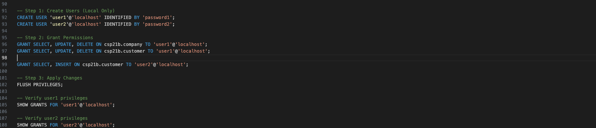

# LIS4930 A.I Applications

## Cole Plympton

### Assignment 2 Requirements:

*Four Parts:*

1. MySQL Database Setup & Table Creation
2. User Privileges & Access Control
3. Query Execution & Verification
4. Entity Relationship Diagram, and SQL Code [lis3781_a2_solutions.sql](lis3781_a2_solutions.sql "lis3781_a2_solutions.sql")

#### Assignment Screenshots:

#### Screenshot of A2 SQL:

#### Screenshot of A2 Populated Tables:

#### Screenshot of A2 User Privileges:

#### Screenshot of A2 Query Verification (Permission Errors):

#### Screenshot of A2 Table Removal:
