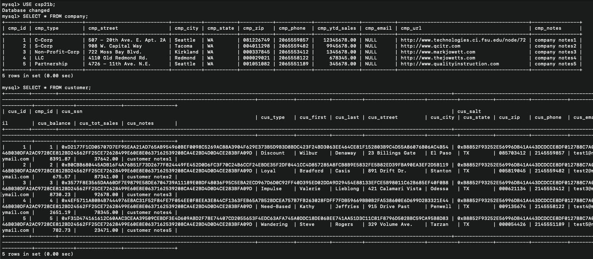
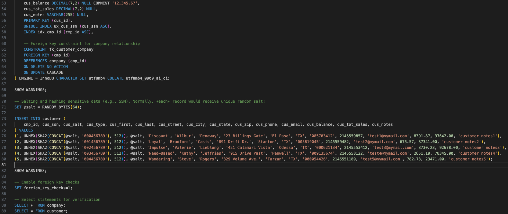

# LIS4930 A.I Applications

## Cole Plympton

### Assignment 2 Requirements:

*Four Parts:*

1. Distributed Version Control with Git and Bitbucket
2. AMPPS Installation
3. Questions 
4. Entity Relationship Diagram, and SQL Code [lis3781_a2_solutions.sql](lis3781_a2_solutions.sql "lis3781_a2_solutions.sql")

# A1 Database Business Rules:

#### Assignment Screenshots:

#### Screenshot of A2 SQL:

#### Screenshot of A2 Populated Tables:

