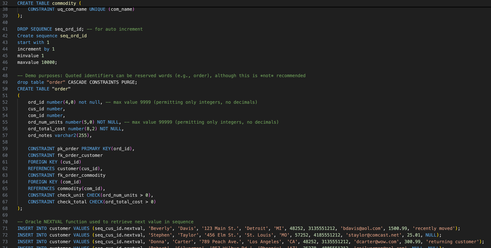

# LIS3781 Database Management

## Cole Plympton

### Assignment 3 Requirements:

*Four Parts:*

1. **Oracle Server Login & Setup**  
   - Log into the Oracle Server using RemoteLabs and verify access.

2. **Creating and Populating Tables**  
   - Create and populate tables as per the instructional video, ensuring data integrity.

3. **Generating Required Reports**  
   - Execute the required SQL queries, format outputs correctly, and ensure proper sorting.

4. **SQL Code & Documentation**  
   - Save all SQL commands in [lis3781_a3_solutions.sql](lis3781_a3_solutions.sql "lis3781_a3_solutions.sql").

#### Assignment Screenshots:

#### Screenshot of SQL Code Used to Create and Populate Tables:

#### Screenshot of Populated Tables:

#### Screenshot of Required Report & SQL Code Solution #8. List customer details:

#### Link to Full SQL File:
[lis3781_a3_solutions.sql](lis3781_a3_solutions.sql "lis3781_a3_solutions.sql")
