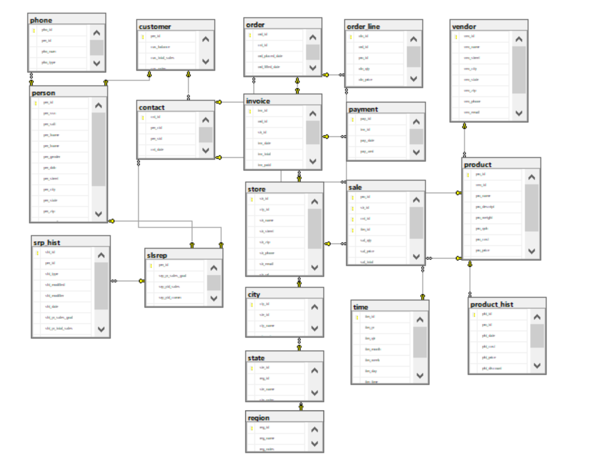
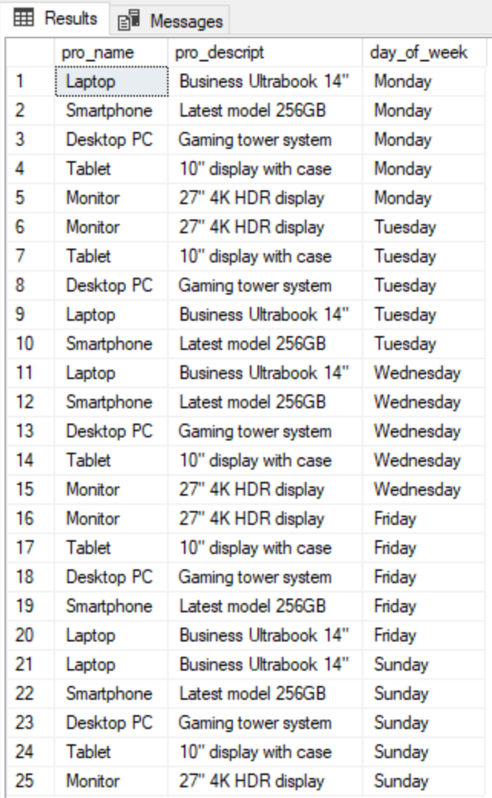

# LIS3781 Database Management

## Cole Plympton

### Assignment 5 Requirements:

*Deliverables:*

1. **Entity-Relationship Diagram (ERD)**
   - Tables must be populated using RemoteLabs – MS SQL Server
2. **SQL Statement Questions**
3. **README.md file** including:
   - Screenshot of ERD
   - Screenshot of at least one required report and SQL code solution
   - Bitbucket repo link
   - Link to [lis3781_a4_solutions.sql](lis3781_a5_solutions.sql "lis3781_a4_solutions.sql")

#### Assignment Screenshots:

#### Screenshot of ERD:

#### Screenshot of Report 1 & SQL Code Solution:

#### Link to SQL Solutions File:
[lis3781_a4_solutions.sql](lis3781_a5_solutions.sql "lis3781_a4_solutions.sql")

