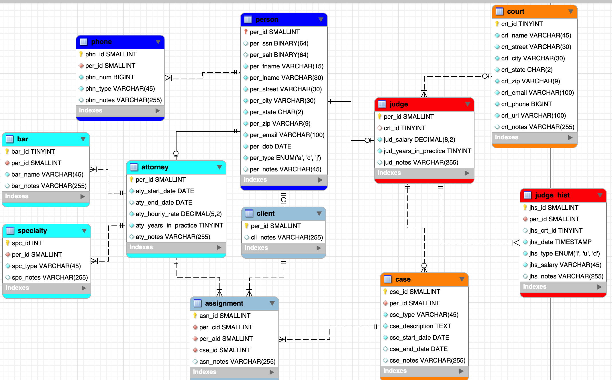
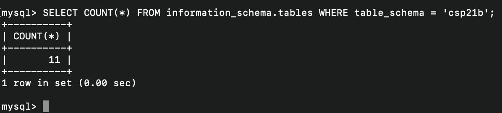
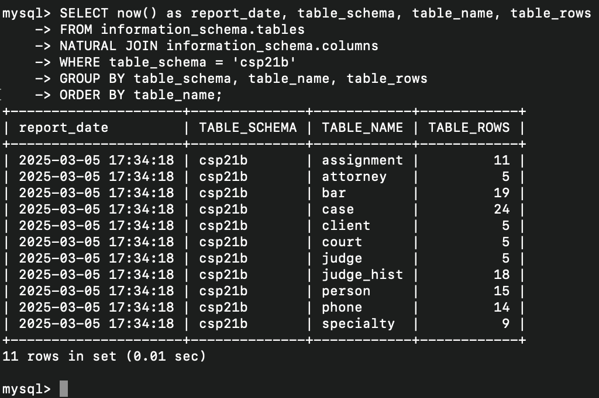
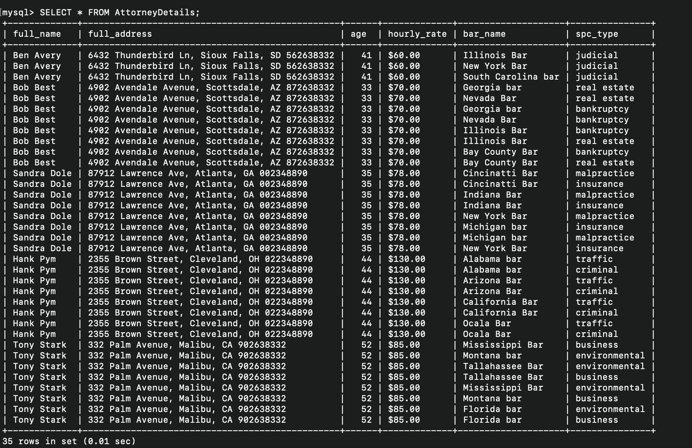

# LIS3781 Database Management

## Cole Plympton

### Project 1 Requirements:

*Four Parts:*

1. **Entity-Relationship Diagram (ERD)**
2. **Database Implementation**
3. **SQL Queries and Procedures**
4. **SQL Code & Documentation**
   - Save all SQL commands in [lis3781_p1_solutions.sql](lis3781_p1_solutions.sql "lis3781_p1_solutions.sql")

#### Project Screenshots:

#### Screenshot of ERD:

#### Screenshot of Number of Tables (11):

#### Screenshot of Populated Tables (11):

#### Screenshot of Required Report & SQL Code Solution:

#### Link to Full SQL File:
[lis3781_p1_solutions.sql](lis3781_p1_solutions.sql "lis3781_p1_solutions.sql")